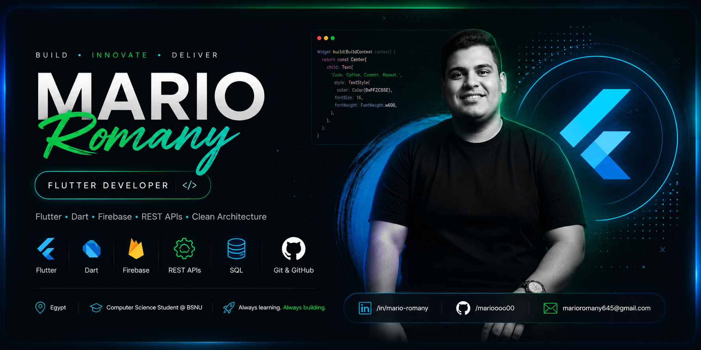
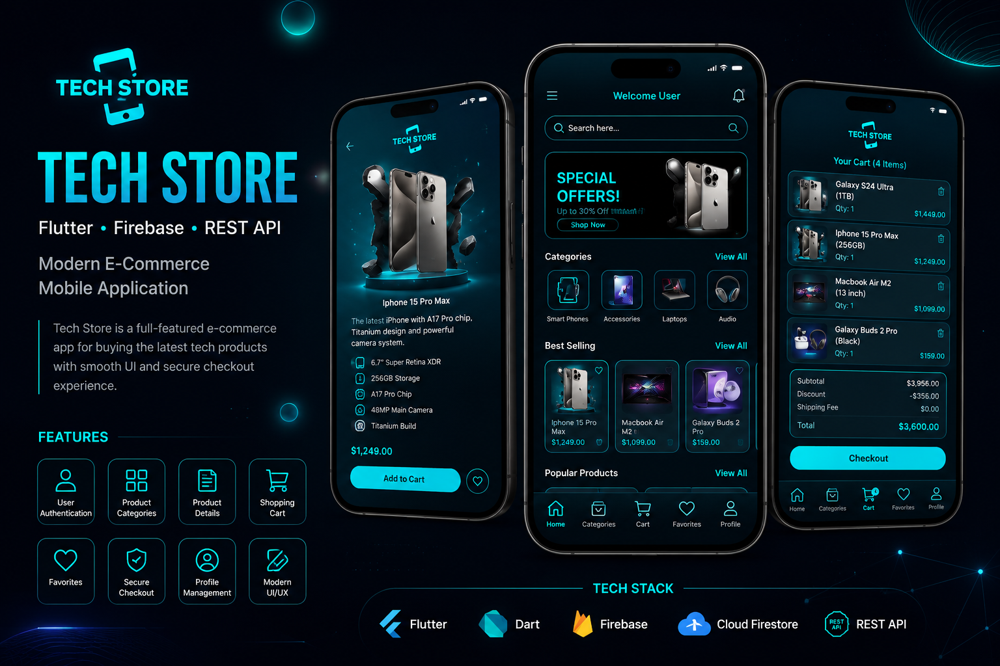
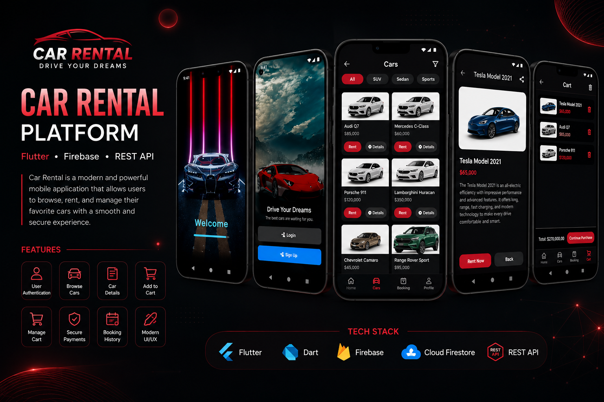
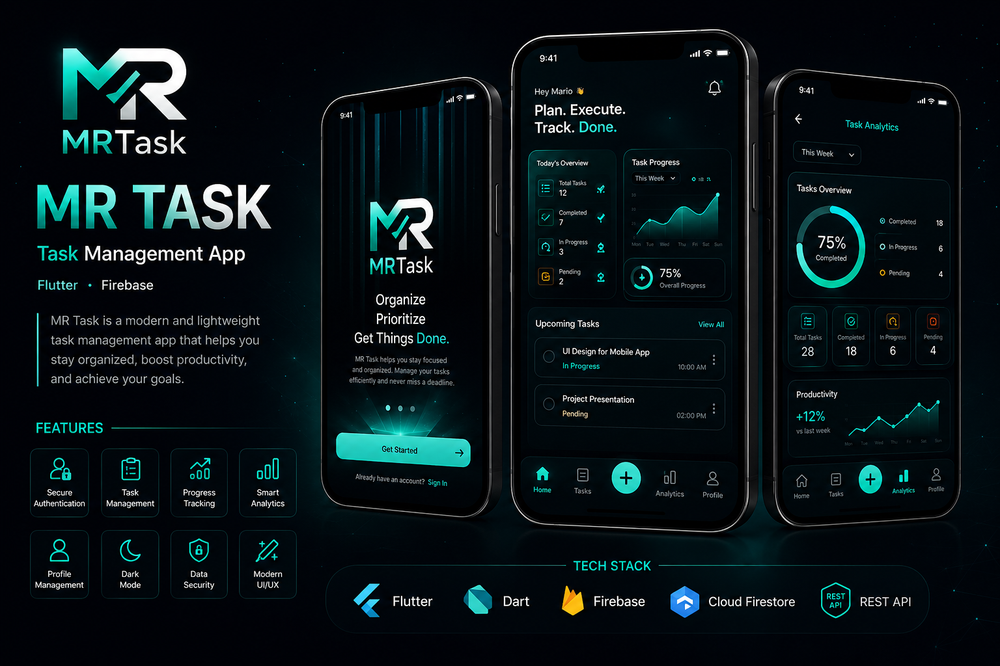

<p align="center">
  
</p>

<h1 align="center">
Hi 👋, I'm Mario Romany
</h1>

<h3 align="center">
Flutter Developer 📱 | Computer Science Student @ BSNU
</h3>

<p align="center">
Passionate Flutter Developer specialized in building beautiful, scalable and high-performance mobile applications with Flutter & Firebase.
</p>

<p align="center">

<a href="https://www.linkedin.com/in/mario-romany-865669299">

</a>

<a href="mailto:marioromany645@gmail.com">

</a>

<a href="https://wa.me/201034120062">

</a>

<a href="https://github.com/marioooo00">

</a>

</p>

---

<p align="center">


</p>

---

# 🚀 About Me


- 🎓 Computer Science Student at **BSNU**
- 📱 Flutter Mobile Application Developer
- 🔥 Passionate about building modern mobile applications
- 💙 Flutter & Firebase Enthusiast
- 🌱 Currently learning Clean Architecture & Advanced State Management
- 🚀 Looking for Internship Opportunities
- 📍 Minya, Egypt

<br><br><br>

---

# 🛠 Tech Stack

<p align="center">


</p>

---

# 📊 GitHub Statistics
<p align="center">


</p>

---

# 🔥 GitHub Streak

<p align="center">

</p>

---

# 📈 Contribution Graph

<p align="center">


</p>
---

# 🚀 Featured Projects

<table>
<tr>

<td align="center" width="50%">
<h3>💻 Tech Store</h3>



Flutter • Firebase
</td>

<td align="center" width="50%">
<h3>🚗 Car Rental</h3>



Flutter • REST API
</td>

</tr>

<tr>

<td colspan="2" align="center">

<h3>✅ MR Task</h3>



Flutter • Firebase

</td>

</tr>

</table>
---

# 💻 Currently Learning

```text
✅ Flutter Advanced
✅ Firebase
✅ REST API
✅ Clean Architecture
✅ State Management
✅ SOLID Principles
```

---

# 📫 Connect With Me

<p align="center">

<a href="mailto:marioromany645@gmail.com">

</a>

<a href="https://www.linkedin.com/in/mario-romany-865669299">

</a>

<a href="https://wa.me/201034120062">

</a>

<a href="https://github.com/marioooo00">

</a>

</p>

---

# 👀 Profile Views

<p align="center">


</p>

---

<div align="center">

## 💙 Thanks for visiting my profile!

### ⭐ If you like my work, don't forget to Star my repositories ⭐


</div>
